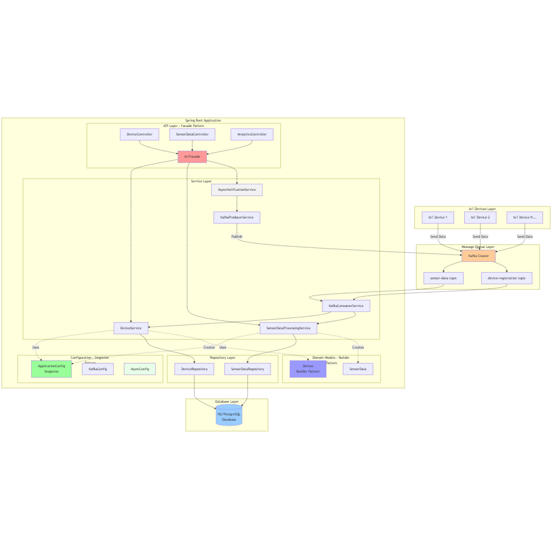

# IoT Data Processing System - Design Documentation

## Overview
This document describes the architecture, design decisions, and implementation details for a scalable IoT data processing and analytics system built with Spring Boot, Kafka, and Java 17. The system is designed to ingest, process, and analyze data from over 100,000 IoT devices in a scalable, fault-tolerant, and high-throughput manner.

## Implemented Design Patterns

### 1. Builder Pattern
Location: `com.iot.model.Device`
Purpose: Simplifies the creation of complex Device objects with many attributes.

```java
// Usage example:
Device device = Device.builder()
    .deviceId("device-123")
    .deviceType("sensor")
    .location(location)
    .status(DeviceStatus.ACTIVE)
    .build();
```

Benefits:
- Fluent interface for object construction
- Validation during build process
- Immutable object creation
- Clear separation of construction logic

### 2. Singleton Pattern
Location: `com.iot.config.ApplicationConfig`
Purpose: Manages application-wide configuration and caching.

```java
// Usage example:
ApplicationConfig config = ApplicationConfig.getInstance();
int batchSize = config.getDeviceBatchSize();
```

Benefits:
- Centralized configuration management
- Thread-safe implementation
- Lazy initialization
- Spring-managed lifecycle

### 3. Facade Pattern
Location: `com.iot.facade.IoTFacade`
Purpose: Simplifies complex interactions between different components of the system.

```java
// Usage example:
@RestController
public class DeviceController {
    private final IoTFacade iotFacade;
    
    public ResponseEntity<Device> registerDevice(DeviceRegistrationDto dto) {
        return ResponseEntity.ok(iotFacade.registerNewDevice(dto));
    }
}
```

Benefits:
- Simplified client interface
- Reduced dependencies between components
- Centralized business logic
- Improved error handling
- Transaction management

---

## System Architecture



### Components
- **IoT Devices**: Send sensor data and registration events.
- **Kafka Cluster**: Provides scalable, fault-tolerant message streaming for device and sensor data.
- **Spring Boot Application**:
  - **Kafka Producer/Consumer**: Handles ingestion and processing of device and sensor data.
  - **Service Layer**: Implements business logic, analytics, and data quality assessment.
  - **REST API**: Exposes endpoints for device management, data ingestion, and analytics.
  - **Persistence Layer**: Stores device and sensor data using JPA/H2 (can be replaced with a production-grade DB).
- **Database**: Stores device metadata and sensor data for analytics and reporting.

---

## Design Principles
- **SOLID & OOP**: All components follow SOLID principles for maintainability and extensibility.
- **Scalability**: Kafka partitioning, stateless services, and batch processing enable horizontal scaling.
- **Fault Tolerance**: Kafka replication, error handling, and transaction management ensure reliability.
- **Separation of Concerns**: Clear separation between controllers, services, repositories, and DTOs.

---

## Key Technologies
- **Java 17**
- **Spring Boot 3.x**
- **Spring Data JPA**
- **Spring Kafka**
- **H2 Database** (for development)
- **Lombok**
- **Maven**

---

## API Endpoints

### Device Management
- `POST /api/devices` - Register a new device
- `GET /api/devices/{deviceId}` - Get device details
- `DELETE /api/devices/{deviceId}` - Delete a device

### Sensor Data
- `POST /api/data` - Ingest sensor data

### Analytics
- `GET /api/analytics/device/{deviceId}` - Get analytics for a device

---

## Data Flow Diagram


---

## Setup & Running

1. **Clone the repository**
   ```bash
   git clone https://github.com/lakkantha/IOT.git
   cd IOT
   ```
2. **Start Kafka** (see README for details)
3. **Build and run the application**
   ```bash
   mvn clean install
   mvn spring-boot:run
   ```
4. **Access API**
   - Swagger/OpenAPI: [http://localhost:8080/swagger-ui.html](http://localhost:8080/swagger-ui.html) (if enabled)
   - Health: [http://localhost:8080/actuator/health](http://localhost:8080/actuator/health)

---

## Design Justification
- **Kafka**: Chosen for high-throughput, durability, and scalability in IoT scenarios.
- **Spring Boot**: Rapid development, robust ecosystem, and easy integration with Kafka and JPA.
- **SOLID/OOP**: Ensures maintainable, extensible, and testable codebase.
- **H2**: Lightweight, in-memory DB for prototyping (replaceable with PostgreSQL/MySQL in production).

---

## Diagrams
- Architecture and data flow diagrams are located in the `docs/` folder. Use tools like draw.io or Lucidchart to edit or export as needed.

---

## Further Improvements
- Add authentication/authorization (OAuth2, JWT)
- Integrate with cloud-native databases (e.g., AWS RDS, Azure SQL)
- Implement advanced analytics and alerting
- Add monitoring and distributed tracing

---

## Recommended Design Patterns (what to use and where)

Below are practical design patterns that fit this project's domain (IoT ingestion, processing, analytics) with mapping to the existing codebase and small guidance for implementation.

- Dependency Injection (Framework: Spring)
   - Where: Already used across controllers/services/repositories.
   - Why: Manages object lifecycle, improves testability, and keeps classes loosely coupled.
   - Action: Continue to prefer constructor injection and mark components with `@Service`, `@Repository`, `@Component`.

- Repository Pattern
   - Where: `src/main/java/com/iot/repository/*` (Spring Data JPA repositories)
   - Why: Encapsulates persistence logic, simplifies mocking in tests.
   - Action: Keep repository interfaces small and focused (one responsibility per interface/query).

- DTO Pattern / Adapter
   - Where: `src/main/java/com/iot/model/dto` and controller -> service boundaries
   - Why: Separates transport models (REST/Kafka payloads) from domain/persistence models.
   - Action: Use mappers (MapStruct or manual mappers) to convert DTOs <-> Entities. Add a `mapper` package when mapping logic grows.

- Factory / Builder
   - Where: Creation of complex domain objects (e.g., building `Device` or enriched `SensorData` for analytics)
   - Why: Simplifies construction logic and makes tests easier.
   - Action: Add a simple `DeviceFactory` or `SensorDataBuilder` when object creation requires validation or transformation.

- Strategy
   - Where: Sensor data processing strategies (per sensor type, per device type)
   - Why: Swap processing algorithms at runtime without conditionals.
   - Action: Create `SensorProcessingStrategy` interface and implementations (e.g., `TemperatureProcessingStrategy`, `HumidityProcessingStrategy`). Wire them via a `Map<String, SensorProcessingStrategy>` in a service and choose by sensor type.

- Chain of Responsibility / Pipeline
   - Where: Multi-step processing of sensor data (validate -> enrich -> transform -> persist -> publish)
   - Why: Keeps single-responsibility for each step and allows dynamic composition of processing steps.
   - Action: Implement processor stages as Spring beans and compose them into a pipeline (`List<DataProcessor>`). Each processor returns success/failure and next-steps.

- Template Method
   - Where: Common high-level processing flow where steps are similar but details differ by sensor type or analytics job
   - Why: Reuse the invariant parts of an algorithm while allowing subclasses to implement specifics.

- Observer / Event-driven (Publisher-Subscriber)
   - Where: When one action should notify multiple listeners (e.g., analytics update, alerts, persistence)
   - Why: Decouples producers from consumers. Use Kafka for cross-process decoupling and Spring ApplicationEvents for in-process.
   - Action: Keep Kafka producers for cross-service events and use in-memory `ApplicationEvent` for local decoupling.

- Adapter
   - Where: Integrating with external systems (Kafka client wrappers, external telemetry APIs)
   - Why: Shields internal model from external SDKs and simplifies testing.

- Circuit Breaker / Retry / Bulkhead (Resilience Patterns)
   - Where: Calls to external systems (e.g., downstream APIs, Kafka brokers, DB) and long-running processing
   - Why: Improve robustness (fail fast, retries, isolate faults).
   - Action: Use Spring Retry and Resilience4j for production readiness.

- Facade
   - Where: Controllers -> one service method that orchestrates multiple lower-level services
   - Why: Simplifies controller logic and hides orchestration details.

---

## Mapping patterns to this repo (concrete suggestions)

- Sensor processing
   - Create `com.iot.service.processing` package with interfaces:
      - `SensorProcessingStrategy` (strategy per sensor type)
      - `DataProcessor` (pipeline stage interface)
   - Move per-sensor logic out of `SensorDataProcessingServiceImpl` into strategies.

- Factories / Mappers
   - Add `com.iot.mapper` package with MapStruct mappers or manual mappers:
      - `DeviceMapper` : `DeviceRegistrationDto` -> `Device`
      - `SensorDataMapper` : `SensorDataDto` -> `SensorData`
   - Add `DeviceFactory` when device creation needs enrichment (defaults, owner assignment, validation).

- Kafka adapter
   - Wrap low-level Kafka code in `com.iot.kafka` adapter classes (e.g., `KafkaProducerAdapter`) exposing simple domain methods (e.g., `publishSensorData(SensorDataDto)`).

- Error handling & resilience
   - Use `@Retryable` on transient operations (Kafka produce retries, remote calls).
   - Use Resilience4j CircuitBreaker for remote systems.

---

## Code examples (short)

1) Strategy interface (example)

```java
package com.iot.service.processing;

public interface SensorProcessingStrategy {
      boolean supports(String sensorType);
      void process(SensorDataDto dto);
}
```

Concrete strategy beans implement `supports` and `process`. A dispatcher service picks the right strategy using the sensor type.

2) Simple pipeline stage interface

```java
public interface DataProcessor {
      ProcessingResult process(SensorData data);
}
```

Pipeline composition example:

```java
@Service
public class ProcessingPipeline {
      private final List<DataProcessor> stages;
      public void execute(SensorData data){
            for(var stage : stages){
                  var result = stage.process(data);
                  if(!result.success()) break;
            }
      }
}
```

3) Mapper (MapStruct) sample

```java
@Mapper(componentModel = "spring")
public interface DeviceMapper {
      Device toEntity(DeviceRegistrationDto dto);
}
```

---

## Trade-offs & guidance

- Start small: introduce patterns where they provide immediate value and avoid over-engineering.
- Prefer simple DI + small interfaces before introducing frameworks (e.g., MapStruct) — add when mapping grows.
- Keep transactional boundaries at service layer; avoid transactions spanning asynchronous Kafka publishes.

---

## Next steps (practical)

1. Add `com.iot.mapper` with one or two mappers (DeviceMapper, SensorDataMapper). Create tests for mapping.
2. Refactor `SensorDataProcessingServiceImpl` to extract a simple Pipeline and one Strategy for a sensor type.
3. Add unit tests for the pipeline and strategy.
4. Add a `kafka` adapter package and wrap producers in domain-friendly methods.
5. Add Resilience4j and Spring Retry for critical external calls.

---

## References
- Enterprise Integration Patterns, Hohpe & Woolf
- Patterns of Enterprise Application Architecture, Fowler
- Spring docs: Dependency Injection, Spring Kafka, Spring Retry, Resilience4j

---

## Contact
For questions or contributions, please open an issue or pull request on GitHub.
